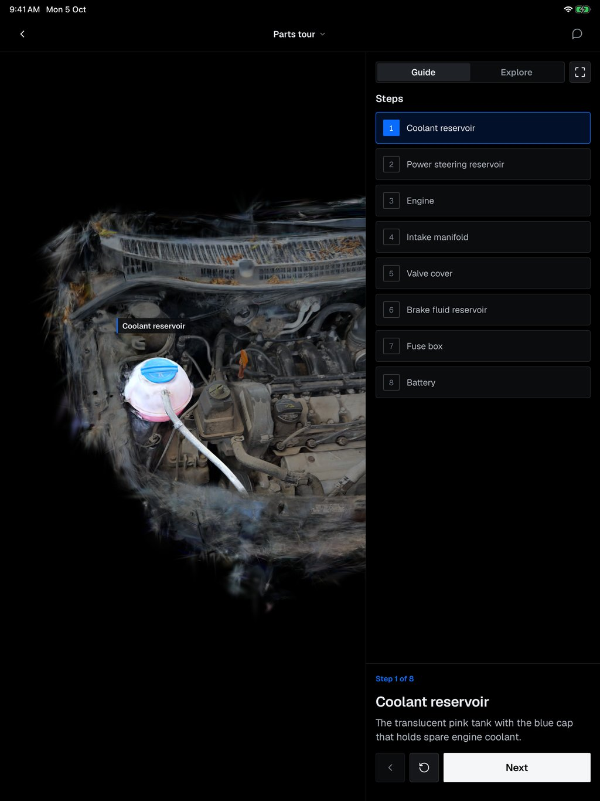
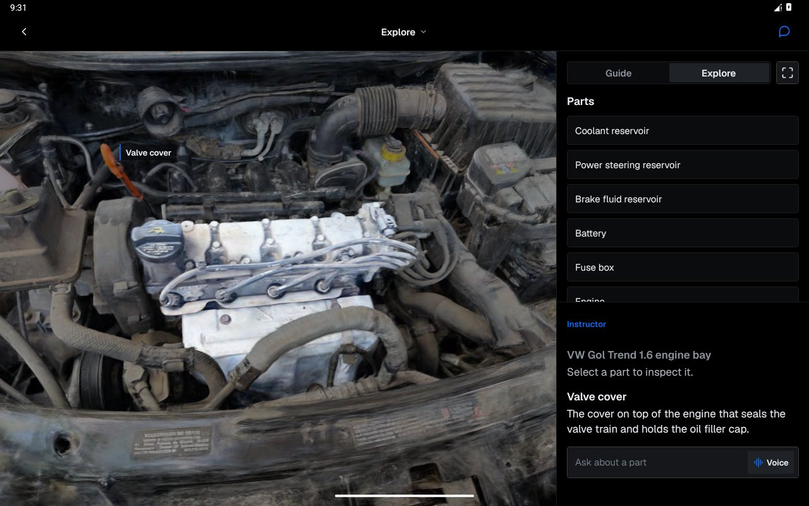
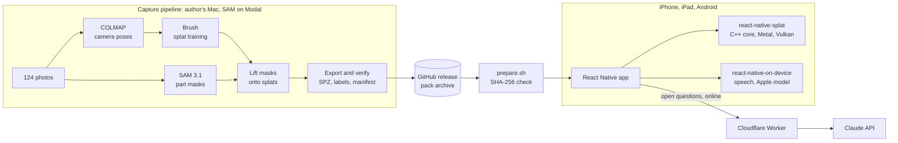
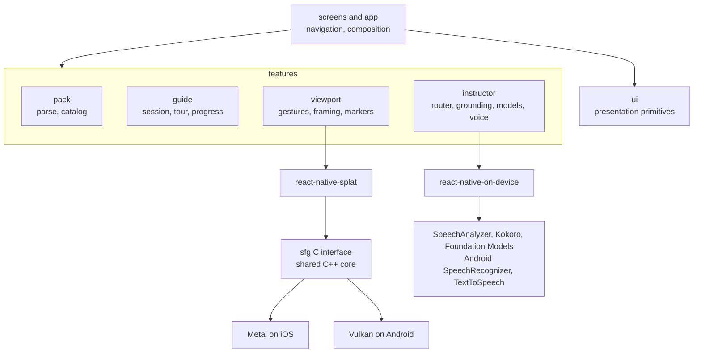
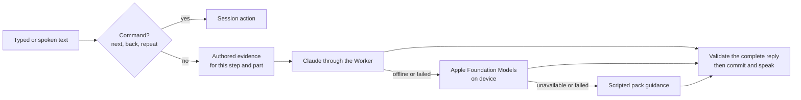

# Splat Field Guide

Field Guide turns a 3D capture of real equipment into a mobile maintenance guide.
You orbit a Gaussian splat of the machine, tap a part to see what it is, follow step-by-step checks with each part highlighted, and ask an instructor by text or voice.
The demo guide is the author's 2010 Volkswagen Gol Trend engine bay, on iPhone, iPad and Android tablets, and it works offline.

<p>
  
  
</p>

## Architecture

### System

A capture becomes a verified pack offline on the author's Mac; the app bundles that pack and only goes to the network for open-ended questions.



### App layers

Screens compose features; features talk to native code only through two local Nitro packages.
ESLint enforces the arrows: `pack` and `guide` are pure TypeScript, and `ui` holds no business code.



### How splats reach the screen

Loading runs once per guide on a worker thread; drawing runs on a render thread and stops when nothing changes.

```mermaid
flowchart LR
  subgraph Load["Load, worker thread"]
    direction TB
    files["cloud.spz and labels.bin<br/>memory-mapped"] --> verify["SHA-256 and splat count<br/>against the manifest"]
    verify --> decode["Decode SPZ v3<br/>2.5M splats"]
    decode --> filter["Drop haze and floaters<br/>labels move with splats"]
    filter --> order["Spatial reorder"]
    order --> index["Pick index"]
    index --> upload["GPU upload"]
  end
  subgraph Frame["Each changed frame, render thread"]
    direction TB
    camera["Orbit camera"] --> visibility["GPU visibility<br/>cull, depth keys"]
    visibility --> sort["GPU radix sort"]
    sort --> draw["Draw sorted splats<br/>SH degree 3, part tint"]
    draw --> present["Present"]
  end
  upload --> camera
```



- Metal composites front to back into a half-float target; Vulkan composites back to front into a scaled offscreen target.
- Gestures run as UI-thread worklets that call `orbit` and `dolly` synchronously through Nitro.
- A tap calls `pick` on a worker: the ray composites the Gaussians it passes, nearest first, and returns the label that contributes most to that pixel.
- The app maps the label to a part, the session expands it to its children, and the renderer tints those splats marine blue and dims the rest while the camera frames them.
- Part markers come from `project`, which reads the last drawn frame's projection synchronously.
- A new cloud materialises with a rising reveal sweep, and `onReady` fires after its first GPU frame.

### Instructor turn

Commands never wait on a model, and every model shares one text-reply interface with ordered fallback.



Streamed words and part emphasis stay provisional until the reply completes, so a failure or interruption leaves the session untouched.

## Decisions

Each row links to its [architecture decision record](docs/adr/) where one exists.

| Decision | Why | Considered and rejected |
| --- | --- | --- |
| Bare React Native with local [Nitro](https://nitro.margelo.com) packages ([0005](docs/adr/0005-bare-react-native-with-local-nitro-packages.md)) | One UI for iOS and Android; Nitro gives typed, synchronous native calls for per-frame gestures and projection reads | Expo managed: the custom engine needs the native projects anyway. Two native apps: two UIs for one product. |
| Own C++ splat engine, a pruned SplatKit copy ([0002](docs/adr/0002-pruned-splatkit-without-lod.md), [0003](docs/adr/0003-shared-core-owns-viewer-behaviour.md)) | Per-splat labels, picking, highlight and framing need control of the data; one core is tested without a GPU and drawn by Metal and Vulkan | Platform viewers such as MetalSplatter: iOS only, so Android would repeat picking and highlight. Unity or Unreal: a heavy runtime inside React Native, without labels. WebGL in a WebView: a second runtime between gestures and drawing. A LOD tree: one engine bay does not need it. |
| SPZ v3 cloud, `labels.bin` sidecar and SHA-256 manifest ([0004](docs/adr/0004-verified-offline-pack.md)) | 63 MB instead of the 636 MB trained PLY; SPZ has no label field, so one label byte per splat rides beside it; every byte is verified before use | Raw PLY: too large to bundle. A custom format: loses SPZ tooling. Streaming: the guide must open offline. |
| Commands first, then Claude, Apple Foundation Models and scripted answers ([0006](docs/adr/0006-commands-and-ordered-instructor-fallback.md)) | Navigation stays deterministic, answers are best online, and something useful remains offline | Cloud only: fails offline. On-device only: the Apple model needs eligible Apple hardware and has no Android version. |
| Cloudflare Worker in front of Claude | Keeps the API key off devices, rate limits per IP and turns the stream into NDJSON | Calling the API from the app: leaks the key. A dedicated server: more to run for one endpoint. |
| iOS voice: SpeechAnalyzer in, Kokoro on CPU ONNX Runtime out ([0008](docs/adr/0008-cpu-kokoro-with-vendored-english-frontend.md)) | On-device, offline and natural; runs in the simulator and its failures are catchable | AVSpeechSynthesizer alone: robotic, kept as fallback. Core ML Kokoro: crash advisories. MLX: no simulator. sherpa-onnx Kokoro: links GPL eSpeak. |
| Android voice: system SpeechRecognizer and TextToSpeech | Uses installed offline voices and recognition | Kokoro on Android: another 105 MB of model resources. |
| COLMAP, Brush and SAM 3.1 on Modal ([0007](docs/adr/0007-local-pipeline-with-colmap-and-modal-sam.md)) | Polycam's camera records had zero translations; Brush trains on the Mac GPU; SAM needs CUDA, so it runs on Modal | Polycam poses: unusable. CUDA-only trainers: no NVIDIA GPU locally. |
| One repository with two native packages ([0001](docs/adr/0001-one-repository.md)) | The pipeline validates packs with the app's own parser, so producer and consumer change together; the viewer and speech packages have unrelated native dependencies | A separate pipeline repository: contract drift. One native package: couples the GPU engine with audio and ML. |

## Repository

| Path | Contents |
| --- | --- |
| [apps/field-guide](apps/field-guide/README.md) | React Native app: screens, features, iOS and Android projects |
| [packages/react-native-splat](packages/react-native-splat/README.md) | Nitro viewer views, shared C++ core, Metal and Vulkan renderers |
| [packages/react-native-on-device](packages/react-native-on-device/README.md) | Nitro speech input and output, Apple Foundation Models |
| [services/instructor-proxy](services/instructor-proxy/README.md) | Cloudflare Worker for Claude |
| [pipeline](pipeline/README.md) | Capture-to-pack stages in Python |
| [content](content/gol-trend-engine-bay) | Authored parts, procedures, knowledge and the pinned pack manifest |
| [docs](docs) | Decisions, design, provenance |

## Quickstart

Use an Apple silicon Mac with the prerequisites in [app setup](apps/field-guide/README.md#setup); [Android setup](apps/field-guide/README.md#android) covers its SDK and emulator.
From the repository root:

```sh
nice -n 19 scripts/prepare.sh
cd apps/field-guide
nice -n 19 npm run ios
```

Preparation downloads the pack from this repository's release with an authenticated `gh` and verifies it; `--pack <archive>` or `FIELD_GUIDE_PACK_URL` override the source.
It then builds or reuses the engine, fetches pinned speech resources and installs JavaScript, Ruby and CocoaPods dependencies.

## Production readiness

| Area | State |
| --- | --- |
| Checks | Unit and interface tests for the app, both native packages, the C interface, Metal drawing, the pipeline and the proxy, plus ESLint boundaries and TypeScript; [CI](.github/workflows/ci.yml) runs the platform-independent set on every push |
| Data integrity | Pack bytes are checked against SHA-256 digests and splat counts at preparation and again at load |
| Offline | Viewer, procedures and scripted answers work in airplane mode; Kokoro voice is bundled |
| Secrets | The Claude key lives only in the Worker, behind a per-IP rate limit and the key's spend cap |
| Distribution | iOS ships through TestFlight; Android Release signs with an upload key read from Gradle properties ([app setup](apps/field-guide/README.md#device-preparation)) |
| Open before a store release | Physical-device performance and voice acceptance, crash reporting, caller attestation on the Worker, a Play upload key and listing, a privacy policy, and the AR check on the real engine ([TASKS.md](TASKS.md)) |

An AR check against the physical engine is in the code but hidden behind `AR_CHECK_ENABLED`, because it needs the real car.

## Read next

- [Design and ownership](docs/specs/field-guide-design.md), [vocabulary](CONTEXT.md) and [targets](REQUIREMENTS.md).
- [Provenance](docs/PROVENANCE.md), [third-party notices](THIRD_PARTY_NOTICES.md) and [MIT license](LICENSE).
- [Agent instructions](AGENTS.md) for commands and contribution rules.
