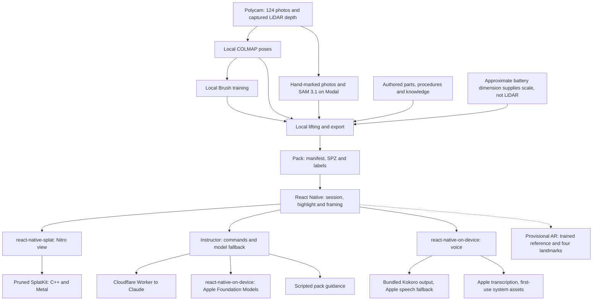

# Splat Field Guide

I built Field Guide to turn a capture of real equipment into a mobile maintenance guide.
The demo is my 2010 VW Gol Trend's engine bay: 124 phone photos, eight named parts and three procedures, with an iPad and iPhone viewer and a spoken instructor.
Commands run locally; questions prefer Claude online, then Apple Foundation Models, then scripted guidance.



## Quickstart

On an Apple silicon Mac, install Xcode 27, an iOS 26+ simulator, Node.js 26+, CMake, Python 3.12+, Ruby and Bundler.
From a clean clone, at the repository root:

```sh
nice -n 19 scripts/prepare.sh --pack /path/to/gol-trend-engine-bay-1.tar.gz
cd apps/field-guide
nice -n 19 npm run ios
```

Preparation verifies the pack, builds the engine, fetches pinned speech resources and installs JS dependencies and CocoaPods through Bundler.
Once published, omit `--pack` to use the release asset; until then, supply the archive or set `FIELD_GUIDE_PACK_URL`.
The [app setup](apps/field-guide/README.md) covers signing and preparing transcription/Apple Intelligence assets before offline voice use.

## Platforms

iOS/iPadOS 26+ is the implemented target by choice, with an iPad-first layout; the provisional AR alignment check needs a physical iPhone on iOS 27 and a separate reference.
Android needs the Vulkan backend, Kotlin/JNI Nitro adapters, resource packaging and speech/local-model implementations; shared C++ geometry and TypeScript guidance can carry over.

## Look next

- [App setup](apps/field-guide/README.md), [capture-to-pack recipe](pipeline/README.md) and [acceptance checklist](TASKS.md).
- [Vocabulary](CONTEXT.md), [decisions](docs/adr/), [research index](docs/research/README.md) and [requirements](REQUIREMENTS.md).
- [Provenance](docs/PROVENANCE.md), [third-party notices](THIRD_PARTY_NOTICES.md) and [MIT license](LICENSE).
- [Agent instructions](AGENTS.md) for the repo map, commands and contribution rules.
