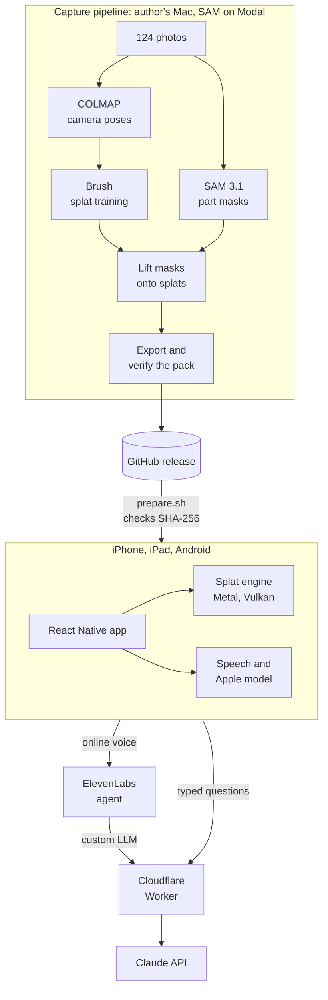
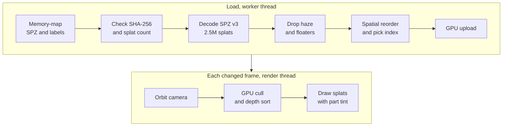
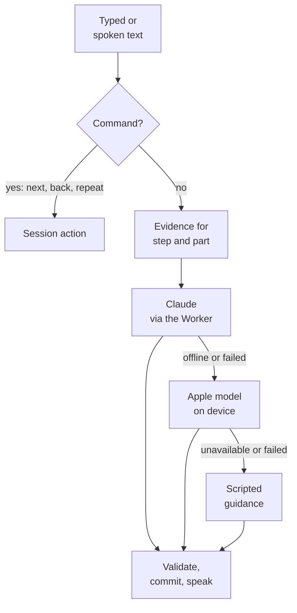
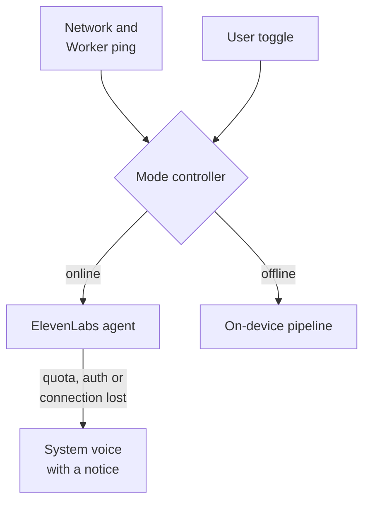

# Splat Field Guide

Field Guide turns a 3D capture of real equipment into a mobile maintenance guide.
You orbit a Gaussian splat of the machine, tap a part to see what it is, follow step-by-step checks with each part highlighted, and ask an instructor by text or voice.
The demo guide is the author's 2010 Volkswagen Gol Trend engine bay, and it works offline.
It is tested on a physical iPhone and the iPad simulator; the Android build runs on the emulator and has not been tested on a physical Android phone or tablet.

## Architecture

A capture becomes a verified pack on the author's Mac; the app bundles the pack and only uses the network for open questions and online voice.



### How splats reach the screen

Loading runs once per guide on a worker thread; drawing runs on a render thread and stops when nothing changes.



- Gestures run as UI-thread worklets that call the engine synchronously through Nitro.
- A tap returns the part label that contributes most to that pixel; the renderer brightens that part, dims the rest and frames it.
- Metal composites front to back into a half-float target; Vulkan composites back to front into a scaled offscreen target.

### Instructor turn

Typed questions and offline speech meet the command router first, so commands never wait on a model, and every model shares one text-reply interface with ordered fallback.



Replies stay provisional until they complete, so a failure or interruption leaves the session untouched.
Android has no on-device model, so offline it answers open questions from the scripted pack guidance.
Commands, procedures and specifications work offline the same way on both platforms.
Online speech goes to the ElevenLabs agent instead: Claude writes its answers through the Worker, and client tools run the same session actions as the router.

### Instructor modes

A mode controller picks online or offline voice from the network and a Worker ping, with hysteresis, and lets the user force either mode.



- Every voice session sits behind one `VoiceSession` port, so only the composition root knows which mode runs ([0009](docs/adr/0009-elevenlabs-agent-online-pipeline-offline.md)).
- The Worker signs each agent session URL, so no ElevenLabs key ships in the app.
- Switching shows each piece as it gets ready, and offline answers say they are limited by the device.

## Decisions

Each row links to its [architecture decision record](docs/adr/) where one exists.

| Decision | Why | Considered and rejected |
| --- | --- | --- |
| Bare React Native with local [Nitro](https://nitro.margelo.com) packages ([0005](docs/adr/0005-bare-react-native-with-local-nitro-packages.md)) | One UI for iOS and Android; Nitro gives typed, synchronous native calls for per-frame gestures | Expo managed: the engine needs the native projects anyway. Two native apps: two UIs for one product. |
| Own C++ splat engine, a pruned SplatKit copy ([0002](docs/adr/0002-pruned-splatkit-without-lod.md), [0003](docs/adr/0003-shared-core-owns-viewer-behaviour.md)) | Labels, picking, highlight and framing need control of the data; one core is tested without a GPU and drawn by Metal and Vulkan | MetalSplatter: iOS only. Unity or Unreal: a heavy runtime inside React Native. WebGL in a WebView: a second runtime between gestures and drawing. |
| SPZ v3 cloud, label sidecar and SHA-256 manifest ([0004](docs/adr/0004-verified-offline-pack.md)) | 63 MB instead of the 636 MB trained PLY, one label byte per splat, and every byte verified before use | Raw PLY: too large to bundle. Streaming: the guide must open offline. |
| Commands first, then Claude, Apple Foundation Models and scripted answers ([0006](docs/adr/0006-commands-and-ordered-instructor-fallback.md)) | Navigation stays deterministic, answers are best online, and something useful remains offline | Cloud only: fails offline. On-device only: the Apple model needs eligible hardware and has no Android version. |
| No on-device model on Android | Offline, the scripted guidance already covers commands, procedures and specifications | Gemini Nano through ML Kit: only on a few recent phones. A bundled model such as Gemma: hundreds of MB in the app. |
| Cloudflare Worker in front of Claude and ElevenLabs | Keeps both keys off devices, signs agent sessions and rate limits per IP | Calling the APIs from the app: leaks the keys. |
| ElevenLabs agent online, on-device pipeline offline ([0009](docs/adr/0009-elevenlabs-agent-online-pipeline-offline.md)) | Natural turn-taking, barge-in and fast first audio online, with Claude still writing every answer; offline keeps working | OpenAI Realtime: answers must come from Claude. ElevenLabs speech-to-text with our own turn-taking: rebuilds what the agent does. Kokoro online: latency and a second voice. |
| Offline voice: SpeechAnalyzer and Kokoro on iOS ([0008](docs/adr/0008-cpu-kokoro-with-vendored-english-frontend.md)), system speech on Android | On-device and offline; Kokoro sounds natural and runs in the simulator | AVSpeechSynthesizer alone: robotic, kept as fallback. Core ML Kokoro: crash advisories. Kokoro on Android: another 105 MB. |
| COLMAP, Brush and SAM 3.1 on Modal ([0007](docs/adr/0007-local-pipeline-with-colmap-and-modal-sam.md)) | Polycam's camera poses were unusable; Brush trains on the Mac GPU; SAM needs CUDA | CUDA-only trainers: no NVIDIA GPU locally. |
| One repository with two native packages ([0001](docs/adr/0001-one-repository.md)) | The pipeline validates packs with the app's own parser; the viewer and speech packages have unrelated native dependencies | A separate pipeline repository: contract drift. |

## Repository

| Path | Contents |
| --- | --- |
| [apps/field-guide](apps/field-guide/README.md) | React Native app: screens, features, iOS and Android projects |
| [packages/react-native-splat](packages/react-native-splat/README.md) | Nitro viewer views, shared C++ core, Metal and Vulkan renderers |
| [packages/react-native-on-device](packages/react-native-on-device/README.md) | Nitro speech input and output, Apple Foundation Models |
| [services/instructor-proxy](services/instructor-proxy/README.md) | Cloudflare Worker for Claude |
| [services/voice-agent](services/voice-agent/README.md) | ElevenLabs instructor configuration, client tools, pronunciation and owner-run sync |
| [pipeline](pipeline/README.md) | Capture-to-pack stages in Python |
| [content](content/gol-trend-engine-bay) | Authored parts, procedures, knowledge and the pinned pack manifest |
| [docs](docs) | Decisions, design, provenance |

## Quickstart

Use an Apple silicon Mac with the prerequisites in [app setup](apps/field-guide/README.md#setup); [Android setup](apps/field-guide/README.md#android) covers its SDK and emulator.
From the repository root:

```sh
nice -n 19 scripts/prepare.sh
cd apps/field-guide
nice -n 19 npm run ios
```

Preparation downloads the pack release with `gh` and verifies it, builds or reuses the engine, and installs the speech resources and dependencies.

## Status

| Area | State |
| --- | --- |
| Testing | iOS on a physical iPhone and the iPad simulator, shipped through TestFlight; Android on the API 36 tablet emulator only |
| Checks | Tests for the app, both native packages, the C interface, Metal drawing, the pipeline and the proxy, plus ESLint boundaries and TypeScript; [CI](.github/workflows/ci.yml) runs the platform-independent set on every push |
| Offline | Viewer, procedures, commands and scripted answers work in airplane mode |
| Online voice | Mode switching and the device fallback are checked on the iPad simulator and Android emulator; a live agent conversation waits on the Worker deploy and agent sync |
| Secrets | The Claude and ElevenLabs keys live only in the Worker, behind a per-IP rate limit; upstream spend limits are set in each provider's console |
| Open before a store release | Physical Android testing, crash reporting, caller attestation on the Worker, a Play listing, a privacy policy, and the AR check on the real engine, which is hidden behind `AR_CHECK_ENABLED` ([TASKS.md](TASKS.md)) |

## Read next

- [Design and ownership](docs/specs/field-guide-design.md), [vocabulary](CONTEXT.md) and [targets](REQUIREMENTS.md).
- [Provenance](docs/PROVENANCE.md), [third-party notices](THIRD_PARTY_NOTICES.md) and [MIT license](LICENSE).
- [Agent instructions](AGENTS.md) for commands and contribution rules.
