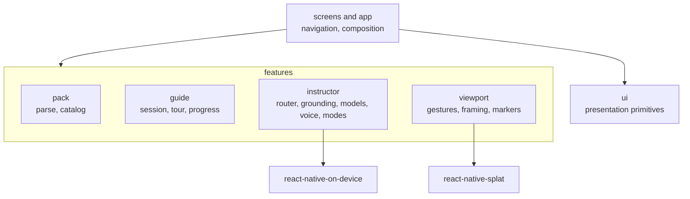

# Field Guide app

The app composes the [guide design](../../docs/specs/field-guide-design.md) with local viewer and speech packages.
Its platform/bridge choice is recorded in [ADR 0005](../../docs/adr/0005-bare-react-native-with-local-nitro-packages.md).

## Layers

Screens compose features; features talk to native code only through two local Nitro packages.
ESLint enforces the arrows: `pack` and `guide` are pure TypeScript, and `ui` holds no business code.

## Setup

| Requirement | Preparation |
| --- | --- |
| Build machine | Apple silicon Mac, Xcode 27 and selected command-line tools |
| Tools | Node.js 26+, npm, CMake, Python 3.12+, Ruby and Bundler |
| Viewer | iOS/iPadOS 26+ with an A14-class GPU or later |
| Voice input | Microphone/speech permission and downloaded system transcription assets |
| Offline questions | Eligible Apple Intelligence hardware, enabled settings and a ready English model |
| Provisional AR | Physical iPhone on iOS 27, the separately prepared reference and `AR_CHECK_ENABLED` in [arCheck.ts](src/app/arCheck.ts) |

Use the [root quickstart](../../README.md#quickstart) to prepare resources and run the app.
The CLI starts Metro; for Xcode, run `npm start` here and open `ios/FieldGuide.xcworkspace` with the FieldGuide scheme.
Engine/resource changes require preparation; the engine builder and reuse rules are in the [viewer package](../../packages/react-native-splat/README.md#engine-preparation).

## Android

Install JDK 17, Android SDK platform/build-tools 37 and NDK 27.1.12297006, and set `ANDROID_HOME` to the SDK directory.
The app supports Android 10+ with Vulkan; the checked build targets API 36 and arm64-v8a.
Prepare the shared pack through the root quickstart, then use the [Android build commands](../../AGENTS.md#android) to build and install.
The [viewer package](../../packages/react-native-splat/README.md#android-adapter) describes pack installation and rendering; Gradle bundles runtime files, Geist fonts and [licenses](../../THIRD_PARTY_NOTICES.md#android-inventory).

For emulator review, use an API 36 arm64 tablet image with 6 GB RAM and the host GPU (`-gpu host`).
The full tier renders with the host GPU; software rendering stalls during upload on the checked Mac, with its limits recorded in the [process record](../../docs/process.md#android).
Microphone permission and an installed recognition model/voice determine offline speech readiness.
Platform capabilities are documented with the [viewer and AR interfaces](../../packages/react-native-splat/README.md#interfaces) and [Android speech/generation](../../packages/react-native-on-device/README.md#android).

## Device preparation

Choose a development team and provisionable bundle identifier in Xcode's Signing & Capabilities.
Debug needs reachable Metro; Release embeds JavaScript.
The [distribution helper](scripts/testflight.sh) requires `FIELD_GUIDE_TEAM_ID` and a signed-in Xcode account; use `--no-upload` to export locally.
Android Release signs with an upload key when `FIELD_GUIDE_UPLOAD_STORE_FILE`, `FIELD_GUIDE_UPLOAD_STORE_PASSWORD`, `FIELD_GUIDE_UPLOAD_KEY_ALIAS` and `FIELD_GUIDE_UPLOAD_KEY_PASSWORD` are set in `~/.gradle/gradle.properties` or as `ORG_GRADLE_PROJECT_` environment variables; without them it uses the debug key, which is fit only for local installs.

Before airplane-mode voice testing, enable voice while connected, grant permissions and complete system asset preparation.
Enable Apple Intelligence on an [eligible device](https://support.apple.com/en-us/121115) and wait for readiness.
Missing transcription/model assets affect offline input and generation; [speech resources](../../packages/react-native-on-device/README.md) supply bundled output.

## Configuration and checks

`instructor.config.json` sets `proxyUrl`, the Worker base URL that [proxy.ts](src/features/instructor/proxy.ts) reads; preparation copies it from [the example](instructor.config.example.json), and git ignores it.
The example's `null` runs offline only; deploy your own Worker with the [service README](../../services/instructor-proxy/README.md) and the agent with the [voice agent README](../../services/voice-agent/README.md).
The iPad uses a side-by-side viewer at 700+ points; the iPhone viewer stays portrait.
App tests, shared fakes and setup live in the root [tests folder](../../tests); commands are in [AGENTS.md](../../AGENTS.md#prepare-and-verify).
[Open acceptance](../../TASKS.md) includes physical performance, voice and AR checks.
