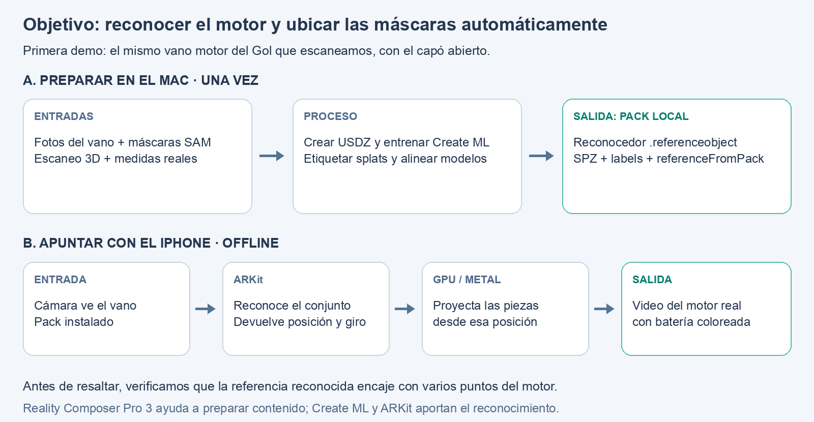

# Pipeline: SAM preprocesado → piezas marcadas sobre el motor en vivo

Estado: propuesta histórica del 2026-10-01; el camino con marcador quedó como diagnóstico y la integración actual de cuatro puntos y eventos Nitro tipados está en [08](08-engine-object-registration.md), con máscaras semánticas todavía propuestas.

## Objetivo: qué debería hacer la app

Apuntás el iPhone al motor real y elegís **«batería»**.
La batería aparece coloreada sobre el video de cámara.
Cuando movés el teléfono, el color cambia de perspectiva y sigue sobre esa pieza.

**Requisito actualizado:** la app debe reconocer automáticamente el vano preparado y obtener su pose 3D antes de colocar las máscaras.
El pipeline de reconocimiento en iOS 27 está en [08: detectar el motor y registrar el modelo](08-engine-object-registration.md).
El marcador de las secciones A/B de abajo queda como herramienta para verificar alineación durante desarrollo.



El dibujo es un esquema de las máscaras semánticas propuestas.
La app ya integra reconocimiento y cuatro puntos para comprobar alineación; esas máscaras todavía no están implementadas.

## Qué entra y qué sale

| Etapa | Entrada | Salida concreta | Para qué sirve |
|---|---|---|---|
| SAM, en la computadora | Fotos del motor; indicás qué pieza marcar | Máscaras 2D: píxeles de «batería» en cada foto | Identificar la pieza en las fotos de preparación |
| `lift_all.py` + `export.py` | Máscaras + reconstrucción 3D + cámaras de esas fotos | `cloud.spz` + `labels.bin`: geometría y nombre de pieza por splat | Saber qué parte del modelo 3D es la batería |
| Referencia y registro, una vez | USDZ texturizado del vano + pack + puntos comunes | `.referenceobject` + `referenceFromPack` | Reconocer el conjunto y hacer coincidir su referencia con nuestros splats |
| ARKit + Metal, en el iPhone | Referencia y pack locales + cámara + pieza elegida | Pose del motor y video con el color sobre la pieza | Mostrar dónde está la batería mientras movés el teléfono |

**El pack es la salida de la preparación y una entrada del teléfono.**
Hoy se incluye durante la compilación tras preparación verificada; la referencia AR se prepara aparte y las descargas dentro de la app son futuras.
ARKit busca el conjunto conocido con la referencia entrenada y entrega la pose; si no está reconocido y registrado, la app mantiene la cámara sin resaltado.

Las máscaras de SAM se convierten en **etiquetas del modelo 3D** durante la preparación.
En el teléfono, Metal dibuja esos splats etiquetados desde la posición actual de la cámara: eso produce el color con la perspectiva correcta.

## Alcance de la primera versión

Usamos **el mismo vano que escaneaste**, iPhone + reconocimiento de objetos ARKit + nuestro renderer Metal.
El reconocimiento automático es el recorrido final.
Las instrucciones con marcador que siguen permiten probar el render y la calibración por separado.

Los scripts de segmentación/exportación existen.
Las funciones y archivos marcados **NUEVO** son propuestas.
Los ejemplos de APIs Swift se verificaron con el compilador del SDK 27; falta probar la alineación y el resultado sobre un motor físico.

Para el iOS 27 de la demo, comparé esta ruta con `ARView`, mallas y splats nativos de RealityKit en [la elección del renderizador](07-arview-registration.md).
La recomendación inicial es extender el renderer Metal existente.

## Herramientas

| Trabajo | Qué usar |
|---|---|
| Máscaras por foto | SAM 3, scripts existentes en Modal |
| Pasar máscaras a piezas 3D | Python, NumPy, COLMAP y `lift_all.py` |
| Calibración del marcador | PyCOLMAP + OpenCV en el Mac |
| Seguir cámara y detectar marcador | ARKit nativo en Swift |
| Dibujar máscara sobre video | Metal + CoreVideo, extendiendo nuestro renderer |
| Pantalla y selección de piezas | React Native + Nitro Views existentes |

## A. Contenido común y calibración de prueba con marcador

### 1. Obtener una etiqueta por splat

**Entradas:** fotos originales, cámaras COLMAP, `engine_30000.ply` y máscaras por pieza.

[sam_live.py](../../pipeline/pack/sam_live.py) permite marcar piezas con SAM 3.
[sam_track.py](../../pipeline/pack/sam_track.py) propaga esas máscaras por las fotos.
Sus salidas alimentan [lift_all.py](../../pipeline/pack/lift_all.py):

```sh
uv run --project pipeline python -m pipeline.pack.lift_all
uv run --project pipeline python -m pipeline.pack.export --labels data/segment/lift/all/labels.npy
```

Son comandos existentes, desde la raíz del repo; no se ejecutaron para esta investigación.

`lift_parts()` reúne votos de las máscaras; `assign()` decide a qué pieza pertenece cada splat.
Resultado: `labels.npy`.
`write_spz()` y `write_labels()` exportan geometría y etiquetas juntas:

```text
data/pack/gol-trend-engine-bay/1/
  manifest.json
  high/cloud.spz
  high/labels.bin
```

**Ejemplo:** los splats de la tapa de válvulas llevan label `7`.
En vivo, vamos a dibujar su cobertura sobre la imagen de cámara.
El teléfono no ejecuta SAM.

### 2. Preparar puntos conocidos y medir la escala

**NUEVO:** `pipeline/prepare_ar_landmarks.py`.

Elegir 8–12 detalles que podamos identificar en la captura y en el motor: esquinas, centros de tornillos, bordes.
Repartirlos por el vano y a distintas profundidades.
Los centros genéricos de las piezas no son suficientes para calibrar con precisión.

Podemos obtener sus coordenadas desde puntos triangulados de COLMAP:

```python
from pipeline.export import Placement

report = json.loads(Path("data/pack/gol-trend-engine-bay/1/publication.json").read_text())
p = report["placement"]
placement = Placement(np.asarray(p["rotation"]), np.asarray(p["origin"]), p["scale"])
rec = pycolmap.Reconstruction("data/capture/full/sparse/0")
p2d = rec.images[image_id].points2D[point2d_index]
if not p2d.has_point3D():
    raise ValueError("Elegir un punto triangulado")
xyz = np.asarray(rec.points3D[p2d.point3D_id].xyz)
xyz_pack = placement.points(xyz.reshape(1, 3))[0]
```

`image_id` y `point2d_index` salen de una pequeña herramienta de selección sobre las fotos; hay que crearla.
`placement` es la misma transformación de [export.py](../../pipeline/pack/export.py), guardada en `publication.json`.
[API PyCOLMAP](https://colmap.github.io/pycolmap/pycolmap.html).

Medir la distancia real entre dos puntos conocidos.
La escala COLMAP→metros es `distancia_real / distancia_COLMAP`.
**Modificar el exportador para usar esa medida**, en lugar de la batería supuesta de 24,2 cm.
Exportar nuevamente y aplicar exactamente la misma transformación a los landmarks.

**Salida nueva:** `ar/landmarks.json`, con nombre y coordenadas métricas de cada punto.
Una imagen anotada ayuda a identificarlos durante la calibración.

La herramienta muestra los `points2D` de cada foto sobre sus coordenadas `xy`.
Al hacer clic, guarda el índice del punto triangulado más cercano y su nombre.
Así obtenemos pares identificables, por ejemplo «centro del tornillo A» ↔ `[x, y, z]` del pack.

### 3. Calibrar la posición del marcador respecto al motor

Fijar una imagen mate al equipo y medir su ancho impreso.
Debe mantener su posición respecto al conjunto escaneado.

**NUEVO en Swift:** `captureCalibrationFrame(directory:)`.
Mientras ARKit detecta el marcador, congelar **un único ARFrame** y exportar:

```text
calibration/camera.png     imagen cruda, sin girar ni redimensionar
calibration/frame.json     tamaño, intrinsics, camera.transform,
                           transform del marcador y timestamp
```

Para guardar el PNG: `CIImage(cvPixelBuffer: frame.capturedImage)`, `CIContext.createCGImage()` y `CGImageDestinationCreateWithURL()`.
Guardar las matrices como filas JSON.
Extraer el marcador de `frame.anchors`, evitando mezclar datos de instantes distintos.

En el Mac, marcar sobre `camera.png` los mismos puntos de `landmarks.json`, usando `cv2.setMouseCallback()`.
Si la herramienta reduce la foto en pantalla, convertir los clics nuevamente a píxeles originales.

**NUEVO:** `pipeline/calibrate_ar.py`.
Resolver posición y orientación del modelo con OpenCV:

```python
ok, rvec, tvec, inliers = cv2.solvePnPRansac(
    points3d_m, points2d_raw, K, None,
    iterationsCount=200, reprojectionError=3.0,
    confidence=0.999, flags=cv2.SOLVEPNP_EPNP,
)
if not ok or inliers is None or len(inliers) < 6:
    raise ValueError("Repetir puntos/calibración")
idx = inliers.ravel()
rvec, tvec = cv2.solvePnPRefineLM(
    points3d_m[idx], points2d_raw[idx], K, None, rvec, tvec
)
R, _ = cv2.Rodrigues(rvec)
camera_cv_from_pack = np.eye(4)
camera_cv_from_pack[:3, :3] = R
camera_cv_from_pack[:3, 3] = tvec.ravel()

cv_to_ar = np.diag([1, -1, -1, 1])
world_from_pack = world_from_camera @ cv_to_ar @ camera_cv_from_pack
marker_from_pack = np.linalg.inv(world_from_marker) @ world_from_pack
```

**Qué calculamos:** `marker_from_pack` dice dónde está el modelo respecto al marcador.
Guardar esa matriz permite repetir la alineación en otra sesión.

Los umbrales son valores iniciales propuestos.
`None` supone distorsión cero; verificar residuales con `cv2.projectPoints()` y validar desde otra vista.
Los puntos deben corresponder a la imagen cruda y sus intrinsics.
[PnP y convenciones de cámara](https://docs.opencv.org/4.x/d5/d1f/calib3d_solvePnP.html).

**Salida:** `ar/registration.json`, con ancho físico, nombre del marcador y matriz `markerFromPack`.
Al leer filas JSON en Swift, construir las columnas de `simd_float4x4` explícitamente.

```python
registration = {
    "markerName": "engine-marker",
    "markerWidthMeters": measured_width_m,
    "markerFromPack": marker_from_pack.tolist(),  # 4 filas de 4 números
}
Path("ar/registration.json").write_text(json.dumps(registration, indent=2))
```

`K` se reconstruye con `frame.camera.intrinsics`; `world_from_camera` es `frame.camera.transform`; `world_from_marker` es el transform del `ARImageAnchor` de ese mismo frame.
No usar la matriz girada de la vista AR para esta calibración sobre la foto cruda.

### 4. Empaquetar lo que descarga el teléfono

```text
pack/
  manifest.json
  high/cloud.spz
  high/labels.bin
  ar/marker.png
  ar/registration.json
```

Los landmarks y archivos de calibración son herramientas de autoría; no hacen falta durante el uso normal.

Agregar los archivos AR al contrato de pack y a su verificación de hashes.
Una vez instalados localmente, podemos arrancar la sesión en modo avión.

## B. Prototipo con marcador para validar el overlay

### 5. Abrir una vista AR nativa

**NUEVOS:** `SplatARView.nitro.ts`, `HybridSplatARView.swift` y `ARSessionController.swift`, dentro de `packages/react-native-splat`.

La vista recibe rutas locales del pack y los labels que selecciona React Native.
Su superficie reutiliza `SplatMetalView`; la sesión pertenece a Swift.
Agregar `NSCameraUsageDescription` y enlazar ARKit/CoreVideo/CoreImage/ImageIO junto a Metal.

Cargar el PNG y configurar ARKit:

```swift
let reference = ARReferenceImage(
    markerCGImage, orientation: .up, physicalWidth: widthMeters
)
reference.name = "engine-marker"
let configuration = ARWorldTrackingConfiguration()
configuration.detectionImages = [reference]
configuration.maximumNumberOfTrackedImages = 1
session.delegate = controller
session.viewLayer = metalView.layer
session.run(configuration)
```

`markerCGImage` y `widthMeters` se leen del pack.
El primer argumento del initializer no lleva etiqueta.
[ARReferenceImage](https://developer.apple.com/documentation/arkit/arreferenceimage/init(_:orientation:physicalwidth:)-8b3bs), [Seguimiento de imágenes](https://developer.apple.com/documentation/arkit/arworldtrackingconfiguration/maximumnumberoftrackedimages).

Estos snippets de orientación usan iOS 27.
Si el teléfono tiene iOS 26, usar las firmas anteriores basadas en `UIInterfaceOrientation`; la ruta con marcador sigue siendo viable.

### 6. Colocar el modelo cuando aparece el marcador

En `session(_:didUpdate:)` con un `ARFrame`, buscar:

```swift
guard let marker = frame.anchors
    .compactMap { $0 as? ARImageAnchor }
    .first(where: {
        $0.referenceImage.name == "engine-marker" && $0.isTracked
    }) else { return }
```

Cuando se detecta por primera vez:

```swift
let worldFromPack = marker.transform * markerFromPack
let equipment = ARAnchor(name: "engine-pack", transform: worldFromPack)
session.add(anchor: equipment)
```

Agregar ese anchor una sola vez, guardar su UUID y leer su transform desde los siguientes frames.
El estado mínimo del controller es `searchingMarker → aligned → trackingLimited`; no crear un anchor nuevo en cada callback.

**Resultado visible:** el modelo ya está ubicado sobre el motor.
Puede mostrarse primero un pin sobre un landmark para verificar el encaje.
El marcador puede salir de cámara mientras world tracking mantiene la referencia; al volver a verlo, comparar posiciones para detectar deriva.
Si la sesión se resetea, volver a detectar el marcador.

### 7. Preparar cada frame para Metal

Modificar [SplatRenderLoop.swift](../../packages/react-native-splat/ios/SplatRenderLoop.swift): cuando está en AR, cada tick toma `session.currentFrame` una sola vez.
Usar el anchor del equipo presente en ese frame.

```swift
guard let frame = session.currentFrame,
      let angle = session.viewRotationAngle else { return }
let viewFromWorld = frame.camera.viewMatrix(viewRotationAngle: angle)
let projection = frame.camera.projectionMatrix(
    viewRotationAngle: angle, viewportSize: drawablePixelSize,
    zNear: 0.05, zFar: 20
)
let viewFromPack = viewFromWorld * worldFromPack
let cameraUVFromViewport = frame.displayTransform(
    viewRotationAngle: angle, viewportSize: drawablePixelSize
).inverted()
```

`drawablePixelSize` coincide con el tamaño del drawable Metal.
`displayTransform` se invierte porque el shader recorre la pantalla y necesita saber qué píxel de cámara consultar.
[Matrices de cámara](https://developer.apple.com/documentation/arkit/arcamera), [Transformación de imagen](https://developer.apple.com/documentation/arkit/arframe/displaytransform(viewrotationangle:viewportsize:)).

En el backend Metal, crear texturas con `CVMetalTextureCacheCreateTextureFromImage()`: plano Y como `.r8Unorm`, plano CbCr como `.rg8Unorm`.
Usar las dimensiones de cada plano y convertir YCbCr a RGB en el shader.
Retener el frame y los wrappers `CVMetalTexture` hasta completar el command buffer.
[Ejemplo Metal de Apple](https://developer.apple.com/documentation/arkit/displaying-an-ar-experience-with-metal).

Todo ocurre nativamente.
React Native transmite la selección, no video ni matrices por frame.

### 8. Proyectar los splats desde esa cámara

**NUEVAS funciones propuestas** en `sfg.h` y `sfg_metal.h`, con implementación C++/Objective-C++:

```c
void sfg_set_external_camera(sfg_engine* engine,
    const float view16[16], const float projection16[16]);
void sfg_set_ar_mask_mode(sfg_engine* engine, bool enabled);
// En sfg_metal.h, importando CoreVideo:
void sfg_metal_set_ar_frame(sfg_engine* engine,
    CVPixelBufferRef pixelBuffer, const float cameraUVFromViewport9[9]);
```

Las matrices C se pasan en orden de columnas, como `simd_float4x4`.
El engine copia sus valores y el backend retiene el pixel buffer; Swift llama las tres funciones desde el render thread antes de `sfg_draw()`.

En [SplatEngine.cpp](../../packages/react-native-splat/engine/splatkit-engine/src/engine/SplatEngine.cpp), `step()` usará las matrices externas y omitirá orbit/refit en modo AR.
Cada frame nuevo pide redraw, aunque el teléfono permanezca quieto: la imagen de cámara sigue cambiando.

Reutilizar culling, ordenamiento y rasterización existentes.
En `SplatProjection.metalh`, adaptar `projectCovariance()` a la proyección completa.
Este es el cálculo a trasladar a Metal, escrito con índices de filas para que sea legible:

```python
c = P @ np.array([x_view, y_view, z_view, 1.0])
Jx = width / 2 * (P[0, :3] * c[3] - P[3, :3] * c[0]) / c[3]**2
Jy = height / 2 * (P[1, :3] * c[3] - P[3, :3] * c[1]) / c[3]**2
J = np.stack([Jx, Jy])
T = J @ view_from_pack[:3, :3]
covariance_2d = T @ covariance_3d @ T.T
```

Mantener el filtro de varianza existente y obtener los ejes con `ellipseAxes()`.
Verificar portrait/landscape con el pin y una pieza antes de conectar procedimientos.

### 9. Convertir labels en una máscara y colorear el video

En `SplatRaster.metal`, agregar `semanticFragmentUnder()`.
Mantener el alpha original de **todos** los splats.
El fragmento genera:

```metal
return float4(selected ? alpha : 0.0, 0.0, 0.0, alpha);
```

El blending existente, de adelante hacia atrás, acumula en **R** cuánto se ve de la pieza seleccionada.
**A** acumula cobertura de todo el modelo.
Las otras piezas aportan alpha para tapar lo que tienen detrás.

La selección debe llegar al fragmento desde una tabla de labels o un flag en `Projected`; todavía hay que agregarlo.
Ignorar el dimming/opacidad de UI en esta pasada y omitir su fondo opaco.

En `MetalSplatRenderer::encodeOutput()`, agregar un shader de composición:

```metal
float mask = semanticTexture.sample(linearSampler, screenUV).r;
float3 output = mix(cameraRGB, highlightRGB, 0.45 * mask);
```

Así se ve el **motor real**, con color encima de la pieza visible.
Seleccionar otra pieza solo cambia la tabla; la máscara se dibuja de nuevo desde la cámara actual.

Limpiar la textura semántica a RGBA cero y mantener el blending `out = dst + (1 - dst.a) * src`.
La textura semántica se consulta con `screenUV`; las texturas de cámara se consultan con `cameraUVFromViewport * [screenUV.x, screenUV.y, 1]`.
No aplicar esa transformación a ambas.

### 10. Conectar los procedimientos y verificar

Reutilizar `highlightFor(session, pack)` para los labels activos.
En AR, desactivar `useGuideFraming`, orbit y pinch: el punto de vista lo controla el movimiento del teléfono.

Para tocar piezas, actualizar `pick()` con la inversa de la proyección completa y `viewFromPack`; el cálculo actual solo usa `projX/projY`.
Para el primer experimento, seleccionar desde botones evita depender de ese cambio.

Si `frame.camera.trackingState` deja de ser normal, ocultar el resaltado y pedir recuperar tracking.
Mantener la imagen de cámara visible.

**Orden de entrega:** pin alineado → máscara de una pieza → procedimientos → pérdida/recuperación de tracking → arranque offline y medición de rendimiento.
Probar vistas que no se usaron para calibrar.
Corregir antes la escala y los labels con errores.

Esta primera versión conserva la geometría del motor escaneado.
Si se retira o mueve una pieza, sus labels siguen en la posición original; actualizar ese estado requiere un mecanismo adicional.

## C. Dos ampliaciones concretas

### Manos y herramientas delante del motor

Habilitar `configuration.frameSemantics.insert(.sceneDepth)` solo si `supportsFrameSemantics(.sceneDepth)` devuelve true.
Leer `frame.sceneDepth.depthMap` como `.r32Float` y su confianza.

Agregar `cameraDepth = -viewPos.z` a `Projected` y pasarlo al fragmento.
Consultar el depth map con las UV de cámara y descartar contribuciones si `realDepth + epsilon < cameraDepth`, con confianza al menos media.
Empezar probando `epsilon = 0.03` metros, ajustar con el teléfono.
El depth buffer actual usa un valor fijo para optimización; **no sirve para esta comparación**.
[Profundidad ARKit](https://developer.apple.com/documentation/arkit/ardepthdata).

### Reconocer el motor sin marcador

1. Generar un USDZ texturizado en Mac: `let s = try PhotogrammetrySession(input: photosURL)`; `try s.process(requests: [.modelFile(url: outputUSDZ, detail: .full)])`.
  Recorrer `s.outputs`, manejar `.requestError` y esperar `.processingComplete`.
  [PhotogrammetrySession](https://developer.apple.com/documentation/realitykit/photogrammetrysession).
2. Alinear ese USDZ con el SPZ mediante landmarks comunes y guardar `referenceFromPack`.
  Son reconstrucciones con coordenadas propias.
3. Entrenar: `xcrun createml objecttracker -s engine.usdz -o engine.referenceobject`.
4. En iOS 27, cargar `ARReferenceObject(archiveURL:)` y asignarlo a `configuration.detectionObjects`.
  El `ARObjectAnchor` reemplaza al marcador: `worldFromPack = anchor.transform * referenceFromPack`.

La preparación geométrica de esta propuesta está descrita en [08](08-engine-object-registration.md#qué-existe-ahora).
La referencia ya se limpió y entrenó; falta validar reconocimiento y precisión sobre el motor real, con el estado del modelo actual en [10](10-object-tracking-training-audit.md).
[Entrenamiento](https://developer.apple.com/documentation/visionos/implementing-object-tracking-in-your-app), [Integración iOS](https://developer.apple.com/documentation/visionos/using-a-reference-object-with-arkit-in-ios).
