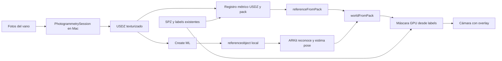
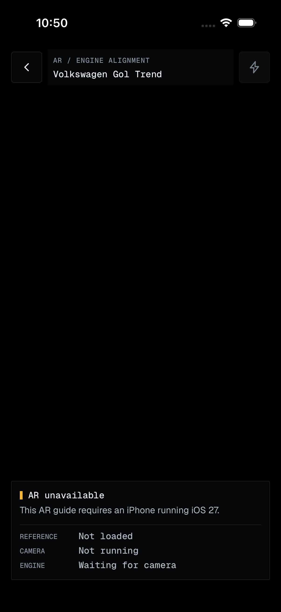
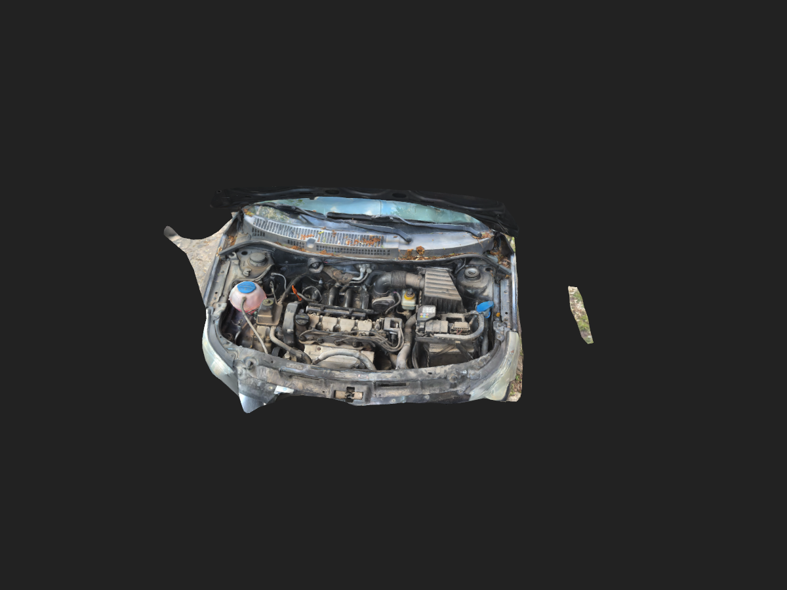

# Reconocer el vano motor y ubicar sus máscaras automáticamente

Estado: diario de implementación del 2026-10-01 al 2026-10-03; cuatro puntos, HUD y flash integrados, con la referencia actual y aceptación física pendientes descritas en [10](10-object-tracking-training-audit.md).

Investigación y primera implementación del **1 de octubre de 2026**.
Requisito: apuntar al motor preparado, reconocerlo y colocar cada máscara sobre su pieza, sin alineación manual en la experiencia final.
iOS 27 confirmado.
La malla está reconstruida, alineada y limpiada; el entrenamiento terminó correctamente.
La app incorpora la prueba de cuatro puntos.
**El 2 de octubre el usuario informó que la prueba con el motor real no funcionó; no se conservó una captura de estados de esa prueba.**
La causa no está identificada.
Ver la [auditoría y pasos de entrenamiento](10-object-tracking-training-audit.md), que actualiza el estado de las comprobaciones pendientes de esta nota.

## Objetivo, entrada y salida

La primera demo reconoce **el mismo Gol y configuración usados para preparar el contenido**, no cualquier motor/coche.
La referencia será el conjunto fijo del vano con capó abierto.
**Detectar el capó móvil no determina la pose del motor:** su bisagra permite una transformación relativa variable.

| Etapa | Entrada | Salida |
|---|---|---|
| Autoría | Fotos del vano, dimensiones reales, pack SPZ/labels | USDZ texturizado registrado al pack |
| Entrenamiento | USDZ fiel al conjunto rígido | `.referenceobject` para ARKit |
| Teléfono | Referencia local y cámara | Identidad conocida y pose 3D |
| Visualización | Pose, SPZ/labels, cámara actual | Máscaras alineadas sobre las piezas |

Apple documenta reconocimiento de referencias entrenadas en **iOS 27**, mediante `ARSession`, `ARWorldTrackingConfiguration` y `ARObjectAnchor`.
Que la página esté bajo `/visionos/` no convierte este API en exclusivo del visor.
[Integración oficial en iOS](https://developer.apple.com/documentation/visionos/using-a-reference-object-with-arkit-in-ios).




## Pipeline propuesto

**1. Construir la referencia geométrica.**
`PhotogrammetrySession` reconstruye desde una carpeta de fotografías y exporta USDZ; hay que comprobar `isSupported` y esperar los resultados asincrónicos.
En Mac se puede empezar con detalle `.medium`, revisar huecos/textura y aumentar calidad si aporta información útil.
[Object Capture](https://developer.apple.com/documentation/realitykit/creating-3d-objects-from-photographs), [Niveles de detalle](https://developer.apple.com/documentation/realitykit/photogrammetrysession/request/detail).

Ya hay un programa completo: [reconstruct_reference.swift](../../pipeline/reconstruct_reference.swift).
Estos comandos se ejecutan desde la raíz del repo; rechazan sobrescribir resultados existentes:

```sh
mkdir -p tools
xcrun swiftc -parse-as-library -O -target arm64-apple-macos15.0 \
  pipeline/reconstruct_reference.swift -o tools/reconstruct-reference
tools/reconstruct-reference --photos data/capture/jpg \
  --output data/ar-reference/gol-trend-engine-bay/medium.usdz --detail medium
```

Salida: `medium.usdz`, `medium.poses.json` y `medium.capture.json`.
Se ejecutó también una versión `.preview`.
Se desactivó el enmascarado automático de objetos para conservar el vano ensamblado; eso deja algunos fragmentos de fondo que requieren limpieza.

`cloud.spz` y un PLY de Gaussianas **no son una malla texturizada**; renombrarlos `.usdz` no prepara la referencia.
Esta malla sirve para reconocer el conjunto.
Los splats existentes siguen generando las máscaras; no se reemplazan por la malla.

**2. Registrar ambos sistemas.**
Object Capture y COLMAP pueden reconstruir las mismas fotos con origen, orientación y escala diferentes.
Medir dimensiones reales y ajustar ambos recursos; luego estimar `referenceFromPack` mediante landmarks compartidos o cámaras correspondientes.
`.poses` entrega cámaras de la reconstrucción, no una transformación ya resuelta hacia nuestro COLMAP.
Guardar la calibración con los IDs/versiones de referencia y pack; verificar landmarks independientes antes de asociarlos.
[Poses de Object Capture](https://developer.apple.com/documentation/realitykit/photogrammetrysession/request/poses).

Implementado en [register_reference.py](../../pipeline/register_reference.py): empareja fotografías por nombre, convierte cámaras COLMAP al sistema del pack y ajusta escala, rotación y traslación.
Reserva una de cada cinco cámaras para comprobar el ajuste.
[prepare_reference.py](../../pipeline/prepare_reference.py) aplica la inversa al USDZ y conserva sus texturas mediante OpenUSD.
Después, [cleanup_reference.py](../../pipeline/cleanup_reference.py) retira un fragmento aislado de fondo: 208 de 86.630 triángulos, conservando las tres texturas y las coordenadas de la malla restante.
Salida: `aligned.cleaned.usdz`, todavía pendiente de validación física.
[Transformaciones USD](https://openusd.org/release/api/class_usd_geom_xformable.html), [Empaquetado USDZ](https://openusd.org/release/api/usdz_package_8h.html).

```sh
uv run pipeline/register_reference.py \
  --poses data/ar-reference/gol-trend-engine-bay/medium.poses.json \
  --output data/ar-reference/gol-trend-engine-bay/medium.registration.candidate.json
uv run pipeline/prepare_reference.py \
  --model data/ar-reference/gol-trend-engine-bay/medium.usdz \
  --registration data/ar-reference/gol-trend-engine-bay/medium.registration.candidate.json \
  --output data/ar-reference/gol-trend-engine-bay/aligned.candidate.usdz
```

El modelo preparado queda en coordenadas del pack.
**Eso no prueba que el origen de la referencia entrenada sea idéntico:** comprobarlo antes de publicar `referenceFromPack` para el anchor.

**Reality Composer Pro 3** permite preparar contenido también para iOS y ofrece Shader Graph, Script Graph y Compute Graph.
Puede ayudar a inspeccionar/editar el USDZ, organizar anotaciones y preparar efectos.
Create ML entrena la referencia; ARKit reconoce el objeto en el teléfono.
La receta publicada para cargar referencias y añadir anchoring en Composer Pro está descrita para visionOS: no asumir que ese ejemplo ejecuta automáticamente nuestro renderer iPhone.
[Reality Composer Pro 3](https://developer.apple.com/documentation/realitycomposerpro), [Receta de referencias](https://developer.apple.com/documentation/visionos/using-a-reference-object-with-reality-composer-pro).

**3. Entrenar una referencia.**
Create ML usa USDZ fotorealista, escala correcta y un objeto rígido; entrenamiento local en Mac.
Nuestro [runner](../../pipeline/train_reference.py) ejecuta `xcrun createml objecttracker` en modo standard con `--upright`, guarda progreso, logs y checkpoint, y vigila el espacio libre.
Comando desde la raíz:

```sh
uv run pipeline/train_reference.py \
  --source data/ar-reference/gol-trend-engine-bay/aligned.cleaned.usdz \
  --output data/ar-reference/gol-trend-engine-bay/engine-bay.referenceobject
```

`--front` puede restringir más las vistas si el USDZ está orientado adecuadamente; `--training-mode extended` aumenta costo y tamaño.
Las piezas metálicas/brillantes requieren buena representación; no hay evidencia todavía de precisión o robustez suficientes para nuestro vano grande y complejo.
[Preparación y entrenamiento oficiales](https://developer.apple.com/documentation/visionos/implementing-object-tracking-in-your-app).

**El primer intento falló por falta de disco:** `ENOSPC`, a los 18 minutos y 2,49% de progreso.
No produjo `.referenceobject` ni checkpoint utilizable.
Se retiraron 8,88 GB de temporales de ese intento; se conservaron logs y diagnóstico.
Antes de reintentar, el runner pide 30 GiB libres como margen local conservador, **no como requisito oficial de Apple**.
Cambiar `TMPDIR` no garantiza mover los temporales de Create ML a un SSD: Foundation ignoró esa variable en la prueba local.

**Entrenamiento completado:** del 1 de octubre a las 21:02 UTC al 2 de octubre a las 01:29 UTC, **4 h 26 min 23 s**, modo standard/upright, salida correcta (`exitCode=0`).
Generó `engine-bay.referenceobject`, de 45,35 MB, con modelos de detección y seguimiento.
Se comprobó la integridad ZIP, el hash del USDZ entrenado y que el USDZ incluido es idéntico al original; sus límites geométricos también coinciden.
Eso no verifica todavía la pose del anchor en el teléfono.

Arrancó con 107 GiB libres, proceso desacoplado y `caffeinate -i`; la prioridad de CPU pasó de `nice=10` a `nice=-20` a pedido del usuario.
Estado final: `training-standard.state.json`; resumen: `training-standard.summary.txt`.
Los archivos del intento anterior están conservados en `attempts/`.
[monitor_reference.py](../../pipeline/monitor_reference.py) registró recursos durante los primeros 15 minutos; la GPU medida incluye otras aplicaciones.
Para consultar progreso o resultado: `uv run pipeline/watch_reference.py` desde la raíz.

**Hardware de entrenamiento:** Apple exige un Mac con Apple silicon y macOS 15 o posterior para generar este `.referenceobject`; la CLI de Xcode 27 no ofrece CUDA ni un backend para Windows/Linux.
Una RTX 2060 puede servir en otras etapas: [Brush admite GPUs Nvidia](https://github.com/ArthurBrussee/brush) y [SAM 3 utiliza CUDA](https://github.com/facebookresearch/sam3), pero su memoria disponible y el tamaño del trabajo determinan qué configuración cabe.
No hay un benchmark nuestro que permita comparar velocidades.
[Requisitos de Create ML Object Tracking](https://developer.apple.com/documentation/visionos/implementing-object-tracking-in-your-app).

**Tiempos publicados:** un desarrollador publicó mediciones propias el 14 de septiembre de 2026, con objetos de supermercado y macOS 27:

| Equipo | Modo / vistas | Duraciones observadas |
|---|---|---|
| M4 Max, 128 GB | Standard / Upright | 4 h 02 min y 4 h 09 min |
| M2 Ultra, 192 GB | Standard / Upright | 4 h 35 min y 4 h 41 min |
| M4 Max, 128 GB | Extended / Upright | 28 h 16 min y 29 h |

[Mediciones originales y objetos usados](https://vision.engineer/posts/object-tracking-updates-in-visionOS-27-and-iOS-27/).
Son ensayos pequeños, no un benchmark controlado del vano motor.
Nuestra máquina tiene M4 Pro, 24 GB, **macOS 26.7 y Xcode 27.0**, comprobados localmente; el entrenamiento del vano tardó **4 h 26 min**.
Restringir ángulos no garantiza una gran reducción: el mismo autor midió 4 h 35 min con Upright y 4 h 51 min con All Angles para un mismo objeto.

**4. Reconocer y ubicar offline.**
Cargar la referencia descargada desde URL local:

```swift
let reference = try ARReferenceObject(archiveURL: localReferenceURL)
let configuration = ARWorldTrackingConfiguration()
configuration.detectionObjects = [reference] // Conjunto estático.
session.run(configuration)
```

Procesar `session(_:didAdd:)` y `session(_:didUpdate:)`, identificar el `ARObjectAnchor` y comprobar `isTracked`.
`trackingObjects` se reserva para conjuntos móviles y aumenta consumo.
La matriz es:

```swift
let worldFromPack = objectAnchor.transform * referenceFromPack
// clip = projectionAR * viewAR * worldFromPack * pointPack
```

La referencia identifica **qué pack conocido corresponde**; la pose determina dónde proyectarlo.
Con cámara, matrices y anchor del mismo frame, Metal rasteriza todos los splats para conservar oclusión y acumula solo la contribución del label seleccionado.
No requiere SAM en vivo ni servidor.
La arquitectura del overlay está en [06](06-ar-offline-segmentation.md).

Mostrar resaltado solo mientras exista un anchor de la referencia esperada con tracking válido.
Si no se reconoce el conjunto o se pierde la localización, mantener la cámara y pedir otra vista; no dibujar el pack en una pose arbitraria.
Eso no elimina falsos positivos: la precisión del reconocedor se debe medir.

## Primera prueba de aceptación

Antes de máscaras, reconocer automáticamente el vano y proyectar **cuatro pins sobre landmarks conocidos** desde vistas nuevas.
Medir error en píxeles, éxito/tiempo de reconocimiento, deriva y recuperación.
Repetir con distinta iluminación y oclusión parcial.
Tracking normal de cámara no garantiza que la referencia esté bien registrada.

Ya implementada en la app: abrir la guía del Gol → **Open AR alignment check**.
[ARScreen.tsx](../../apps/field-guide/src/features/ar/screens/ARScreen.tsx) presenta el estado; [ARGuideNativeView.swift](../../packages/react-native-splat/ios/ARGuideNativeView.swift) usa `ARView`, carga archivos locales y coloca cuatro esferas sobre tapones de refrigerante, dirección asistida y líquido de frenos, y una esquina del filtro de aire.
Oculta los puntos si se pierde el objeto o el tracking de cámara.
Estos puntos comprueban alineación; las máscaras completas todavía no están conectadas a esta vista.

**Diagnóstico en vivo:** `uv run pipeline/watch_ar.py --device DEVICE_ID --output .work/ar-check/ar-live.jsonl` abre la app en el iPhone indicado con `--device DEVICE_ID` mediante Xcode y activa `FIELD_GUIDE_AR_DIAGNOSTICS=1`.
Registra carga, errores, estado de cámara, entrega de frames por segundo, anchors recibidos/seguidos y pose a 1 Hz, durante 15 minutos.
Los FPS son de cámara; no representan velocidad ni confianza del modelo.
La API pública no entrega un score de confianza.
Guarda metadatos en el archivo indicado y un estado `.status.json`.
Para conservar la lectura humana, redirigir stdout a `.work/ar-check/ar-monitor.log`; no se escribe automáticamente.
El límite histórico de captura era 512 KiB; la retención suficiente para repetir el veredicto corresponde al monitor actualizado.
La salida a consola está desactivada en los lanzamientos normales.
El HUD del iPhone muestra siempre, a 1 Hz, referencia cargada, estado y FPS de cámara, cantidad de motores encontrados/seguidos y tiempo de sesión, sin Mac ni conexión.
Los metadatos del HUD viven en memoria; no guarda imágenes ni logs en disco.
Una foto en pantalla sirve como experimento; el reconocimiento físico continúa pendiente.

**Cómo funciona, sin APIs:** la copia 3D tiene los cuatro puntos ya colocados.
ARKit intenta reconocer el conjunto y encajar esa copia invisible sobre el objeto real.
Solo después RealityKit dibuja los puntos; mover el teléfono cambia la vista, no sus posiciones dentro de la copia.
Buscar el motor significa que aún falta un encaje válido, no que falle el dibujo.

**Pruebas ejecutables:** [probe_reference.swift](../../pipeline/probe_reference.swift) carga las dos redes del archivo y ejecuta el detector con fotos, devolviendo JSON.
Extrae los modelos temporalmente y los elimina al terminar.
Se ejecutó sobre ocho fotos de reconstrucción: con la conversión BT.601/0–1 asumida, máximos del mapa 0,063–0,423 frente a ~0,026 en colores uniformes.
No son porcentajes de acierto: el preprocesamiento de ARKit no es público, las fotos no son un conjunto independiente y los negativos son solo controles básicos.
El tracker tiene entradas de rayos de cámara y salidas `Classification`, `ConfidenceScore`, `KeyPoints3D`; aquí solo se inspecciona su interfaz.

```sh
xcrun swiftc -O pipeline/probe_reference.swift -o tools/probe-reference
tools/probe-reference data/ar-reference/gol-trend-engine-bay/engine-bay.referenceobject \
  data/capture/jpg/1790717105584360.jpg
# Positivo: abrir AR y apuntar al motor real durante la ventana de captura.
uv run pipeline/watch_ar.py --device DEVICE_ID --output .work/ar-check/ar-live.jsonl --duration 60 --expect detected
# Negativo: misma prueba apuntando a una escena sin ese motor.
uv run pipeline/watch_ar.py --device DEVICE_ID --output .work/ar-check/ar-live.jsonl --duration 60 --expect absent
```

La comprobación devuelve exit 0/1 y exige muestras de cámara y ausencia de errores de sesión.
Un positivo pasa si al menos una muestra tiene un anchor seguido; **no certifica alineación ni estabilidad**.
La captura de la pantalla del Mac falla el positivo: 49 muestras, cero seguidas.
Para aceptar el overlay, todavía hay que medir error de los cuatro puntos, deriva al moverse, recuperación e iluminación con el objeto físico.
Informe del detector: `tools/ar-device-20261002/detector-probe.json`.

**Prueba con foto/video en pantalla, 2 de octubre:** 49 muestras a 1 Hz; referencia cargada en todas, cámara a 60,1 FPS de media, tracking normal en 46 muestras, cero anchors del motor y cero errores registrados de carga/sesión.
No hubo pose para dibujar los puntos.
Esto comprueba captura e integración de la referencia, pero no demuestra precisión ni fallo del reconocedor frente al motor real.
Resumen conservado en `tools/ar-device-20261002/photo-screen-test.summary.json`.

Cada compilación copia automáticamente `engine-bay.referenceobject` si existe.
El simulador muestra la limitación de hardware; el reconocimiento se prueba en un **iPhone físico con iOS 27**.
La matriz identidad actual es candidata: revisar el frame de la referencia entrenada antes de aceptar los puntos como correctos.

**Compilación para iPhone completada el 2 de octubre:** Release firmado en `tools/ar-device-20261002/FieldGuide.app`, referencia y landmarks incluidos y comprobados, firma válida y perfil que incluye el iPhone del usuario.
Se regeneró CocoaPods para incluir archivos del módulo de voz que faltaban en el proyecto local.
Se borraron el directorio temporal de compilación y la app de simulador anterior; se conserva un único artefacto para iPhone y su log.
**Instalada y abierta en el iPhone del autor mediante Xcode `devicectl` por la conexión de red**, sin desinstalar antes la app.
La conservación de datos no se comprobó; el reconocimiento y la alineación físicos siguen pendientes.
Verificación local: `data/ar-reference/gol-trend-engine-bay/engine-bay.verification.json`.

Validación histórica registrada: Release para iPhone y simulador arm64, typecheck, lint y ocho tests de pantalla AR aprobados.
HUD compacto sin la leyenda de colores, con estados y métricas del dispositivo a 1 Hz; botón de flash continuo, que no reinicia AR y se apaga al pausar/salir.
Instalada y abierta en el iPhone del autor.
En simulador iOS 26.5 se comprobó guía → AR → flash deshabilitado → volver.
**El encendido del flash en hardware, el reconocimiento y la precisión física todavía no están verificados.**



Recién cuando los pins coincidan, activar máscaras corregidas.
Un fallback manual puede ayudar a diagnosticar/calibrar durante desarrollo; no forma parte del recorrido automático propuesto.

## Qué existe ahora

| Resultado local | Estado |
|---|---|
| `data/ar-reference/gol-trend-engine-bay/medium.usdz` | Reconstruido con 124 fotos; 43.512 vértices, 86.630 triángulos y texturas incluidas |
| `medium.registration.candidate.json` | 124 cámaras emparejadas; 25 reservadas para comprobar el ajuste |
| `aligned.candidate.usdz` | Transformado al sistema del pack; validación USDZ correcta |
| `aligned.cleaned.usdz` | Limpieza conservadora completada; 86.422 triángulos |
| Primer `.referenceobject` | Standard/Upright en 4 h 26 min; integridad verificada, 45,35 MB; reemplazado por el modelo de [10](10-object-tracking-training-audit.md) |
| Pantalla AR y cuatro puntos | Integrados y compilados; falta comprobar reconocimiento y alineación en iPhone |



El ajuste de cámaras tiene RMSE **0,00133 unidades del pack**, y **0,00138** en las cámaras reservadas.
Es aproximadamente 1,3–1,4 mm bajo la escala estimada del pack; **no es una medición de precisión AR sobre el motor**.
La orientación tiene error p90 de 0,24°.
Se verificaron 100 vértices transformados, topología conservada y texturas idénticas.

El usuario indicó un largo de batería **aproximado de 24,2 cm**, coincidente con la estimación actual.
Sirve para la primera prueba; la escala física sigue sin una medida verificada.
Próximo paso: comprobar el frame del anchor y medir los cuatro puntos sobre el motor real con la referencia actual.
