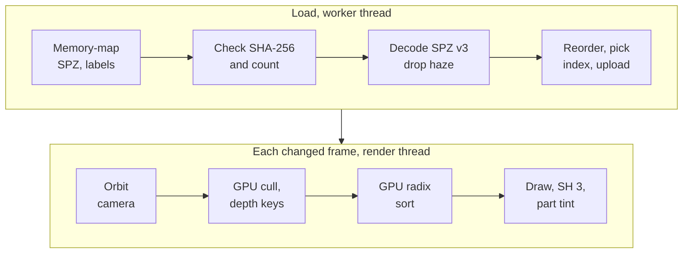

# react-native-splat

Typed Nitro views wrap the shared C++ viewer with Metal on iOS and Vulkan on Android, plus an iOS-only RealityKit AR alignment check.
[ADR 0003](../../docs/adr/0003-shared-core-owns-viewer-behaviour.md) records ownership; [AGENTS.md](../../AGENTS.md#prepare-and-verify) has build, test and codegen commands.

## How it draws

Loading runs once per guide on a worker thread; drawing runs on a render thread for each changed frame.

- Gestures run as UI-thread worklets that call the engine synchronously through Nitro.
- A tap returns the part label that contributes most to that pixel; the renderer brightens that part, dims the rest and frames it.
- Metal composites front to back into a half-float target; Vulkan composites back to front into a scaled offscreen target.

## Engine preparation

The builder produces arm64 device/simulator slices in `ios/Frameworks/SplatKitCore.xcframework` using pinned SPZ/zstd dependencies.
`source-fingerprint.sha256` covers engine source, headers, shaders, CMake inputs and build scripts; complete matching artifacts are reused.
`--force` rebuilds; `SPLAT_BUILD_JOBS` controls concurrency and `SPLAT_IOS_BUILD_DIR` selects the CMake output directory.
The podspec rejects missing/stale artifacts and directs the caller to repository preparation.

## Interfaces

| Interface | Contract |
| --- | --- |
| [SplatView](src/SplatView.nitro.ts) | One engine per view; local SPZ/labels paths, manifest digests and expected source count |
| `onReady` / `onError` | Ready after the accepted cloud's first GPU frame; failure retains the accepted cloud |
| `orbit`, `dolly`, `frame` | Worklet calls enqueue render-thread mutations; radians and metres |
| `pick` | Worker-backed asynchronous part-label result |
| `project`, `drawnDirection` | Synchronous last-drawn-frame reads; float32 projection buffers, NaN behind the camera |
| [C interface](engine/splatkit-engine/include/splatkit/sfg.h) | `sfg_begin_load` reserves ownership; `sfg_load_request` validates optional identity and rejects stale work; `sfg_load` performs unverified standalone loading |
| [ARGuideView](src/ARGuideView.nitro.ts) | iOS only; local reference/landmarks and torch request; typed recognition, actual torch and optional telemetry events |
| [ModelView](src/ModelView.nitro.ts) | iOS only; a bundled USDZ turning on a transparent background, all the way round or swaying either side of its front; reports whether it loaded and holds still under Reduce Motion |

Drawing sleeps when unchanged and pauses while inactive.
The loader checks mapped-file digests and decoded source count on its worker before accepting content.
Dropping a view detaches callbacks and stops its render thread; outstanding calls retain the engine until completion.
C callbacks run on the reporting thread and must not wait for another engine call.

## Android adapter

[The Vulkan adapter](engine/splatkit-android) implements the same `sfg` rendering interface with GPU visibility, radix sorting and splat rasterization.
Label-aware filtering/reordering, picking and camera behaviour stay in the shared core; Vulkan applies the same tint, dimming and reveal parameters as Metal.
The [Kotlin Nitro view](android/src/main/java/com/margelo/nitro/splat/HybridSplatView.kt) owns a TextureView, a render HandlerThread and worker-backed loading.
Choreographer schedules frames while the shared core needs them and pauses on inactivity or detachment.
Bundled assets become app-private files after manifest identity, size and SHA-256 checks; the core verifies the supplied digests and decoded source count before acceptance.
Gradle/CMake build the adapter and embed compiled shaders without an iOS framework.
The Android viewer and its native dependencies are optimised in every variant, including Debug, while React Native Debug stays debuggable.
Android hashing selects ARMv8 SHA-256 instructions when the CPU supports them and uses a bounded PicoSHA2 fallback; iOS uses CommonCrypto.
[Provenance](../../docs/PROVENANCE.md#source-and-resource-identities) records the imported renderer and pinned Vulkan helpers.

## Limits and diagnostics

The iOS viewer requires an A14-class GPU or later; Android requires Vulkan and API 29+ with enough memory for the selected tier.
AR needs a physical iOS 27 iPhone and a separate reference; [acceptance](../../TASKS.md) covers recognition, registration and semantic camera masks.
Camera metadata arrives at 1 Hz and does not measure model confidence or inference speed.
Debug `FIELD_GUIDE_AR_DIAGNOSTICS=1` enables AR console metadata; viewer counters are exposed by `react-native-splat/src/diagnostics`.
iOS Release keeps operational errors and disables diagnostic counters/console output; Android records load and frame timings in logcat.
Artifact tests use fake compilers; C-interface tests run without a GPU and Mac Metal tests exercise drawing.
